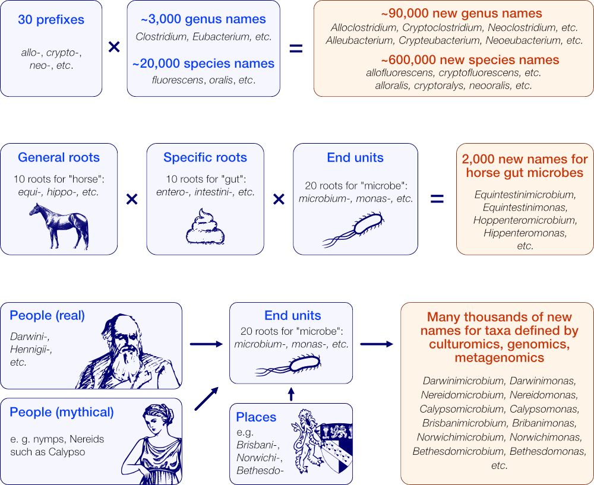
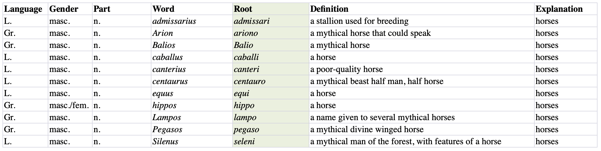

# GAN: The Great Automatic Nomenclator
The Next Million Names for Archaea and Bacteria

## Citation

Mark J. Pallen _et al._ **The Next Million Names for Archaea and Bacteria**, _Trends in Microbiology_ (2020). [DOI: 10.1016/j.tim.2020.10.009](https://www.sciencedirect.com/science/article/pii/S0966842X20302717)

## Principle

To generate a large number of new names, we apply a combinatorial approach starting with two or three sets of _curated roots_, that are processed to produce all their possible combinations while keeping trace of their grammatical metadata to draft a valid etymology.



## Installation

GAN is available on PyPI as `gan-nomenclature` and installs with Python 3.8+:

```bash
pip install gan-nomenclature
```

This command installs the library together with its dependencies (`pandas`, `openpyxl`, ...).

To work in an isolated environment, you can create one with conda and then install the package from PyPI:
```
conda create -c conda-forge -n gan python=3.8 pandas pip ipython
conda activate gan
pip install gan-nomenclature
```

## Command-line tools

Installing the package provides a small suite of CLI helpers:

- `gan-genus`: generate JSON/HTML/LaTeX outputs from two or three curated root tables.
- `gan-init`: scaffold Excel templates (optionally populated with example rows) for use with `gan-genus`.
- `xls2tsv`: convert each worksheet of a workbook into a separate TSV file.

Each command offers `--help` for additional options and usage examples.

## Genera generator

A set of two (or three) Excel tables formatted as shown below is used to generate the list of combinations in JSON, HTML and LaTeX format.



Synopsis:

```bash
usage: gan-genus [-h] -1 FIRST -2 SECOND [-3 THIRD] -o OUTDIR [-p PREFIX] [-c CONNECTOR] [-v]
```

For full usage and installation instructions, please [check the documentation](docs/documentation.md).


## Example output

Using three small files in the _input\_test_ directory (8, 11 and 8 words, respectively), GAN produced 968 (8 x 11 x 8)combinations:

* in [PDF format](https://telatin.github.io/gan/example.pdf)
* in [HTML format](https://telatin.github.io/gan/example.html)

## Etymology

"*The great automatic nomenclaturer*" is a reference to a short story ("_The Great Automatic Grammatizator_") 
written by the British author Roald Dahl [[link](https://en.wikipedia.org/wiki/The_Great_Automatic_Grammatizator)].
